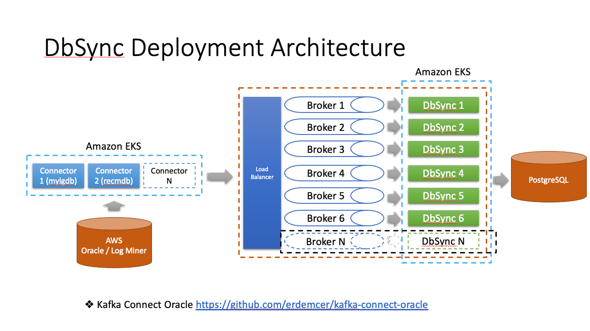

# DbSync Service 

This service is responsible for synchronizing data from `Oracle` to `Postgres` and vice versa. DbSync is built on a
`hexagonal-architecture` architecture, each `Synchronizer` will be responsible for synchronizing a separate table,
they work independently of each other. All Synchronizers will be managed by a `DbSynchronizerManager` that allows to add,
edit, delete or update individual synchronizer, or even multiple synchronizers.


In Terminal, go to the directory of dbsync-service project, switch to `develop` branch
```
$ git checkout develop
```

## Local Development Guide

[https://miniature-potato-286c9dc4.pages.github.io](https://miniature-potato-286c9dc4.pages.github.io/#/)

## Build on local
```
$ ./gradlew clean build

# Or
# ./gradlew clean build -x test
```

Modify datasource/flyway information (`url`, `username`, `password`, etc.) in `application-local.yml` and `application-prod.yml`

## How to start application (2 ways)
1. Modify the information in `application.yml` to decide what environment to use (`dev`, `local`, `prod`, `test`, etc.), then Run/Debug the application on IDE 
2. Using command line:

```
$ ./gradlew bootRun --args='--spring.profiles.active=local'
``` 


## Hexagonal Architecture
The hierarchical architecture is the most traditional and famous architecture mentioned along with DDD.

As the name suggests, it is a multi-layered structure.


A hierarchical architecture consists of four layers:

- Presentation (= UI) layer
    - Where interfaces and applications connect
    - Display of output and interpretation of input
    - Mainly responsible for communication and input/output conversion such as web communication framework and CLI interface.
- application layer
    - It is a direct client of the domain object and is where the objects implementing the use case come together.
    - Application services belong here.
- domain layer
    - Where domain-related objects come together
    - Domain models (entities, value objects), domain services, etc.
    - The repository interface also falls into this category.
- infrastructure layer
    - A place where objects with a technological foundation that support different hierarchies come together.
    - This includes implementation classes such as ORMs, in-memory, etc. that implement repositories.

Now look at the diagram above again and you will understand.
The important point is that the <b>dependency direction is from top to bottom (presentation -> application -> domain). Reliance contrary to this direction is not permitted.</b> (Domain -> infrastructure is not a dependency relationship, but abstraction -> implementation relationship is common. In the diagram above, you can see an arrow where the domain depends on the infrastructure, but it is said that it is not a frequently used pattern at present.)

