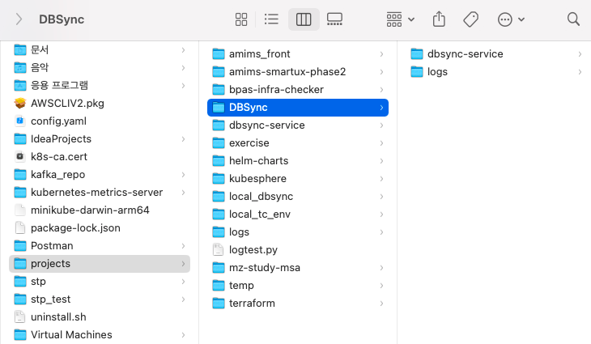
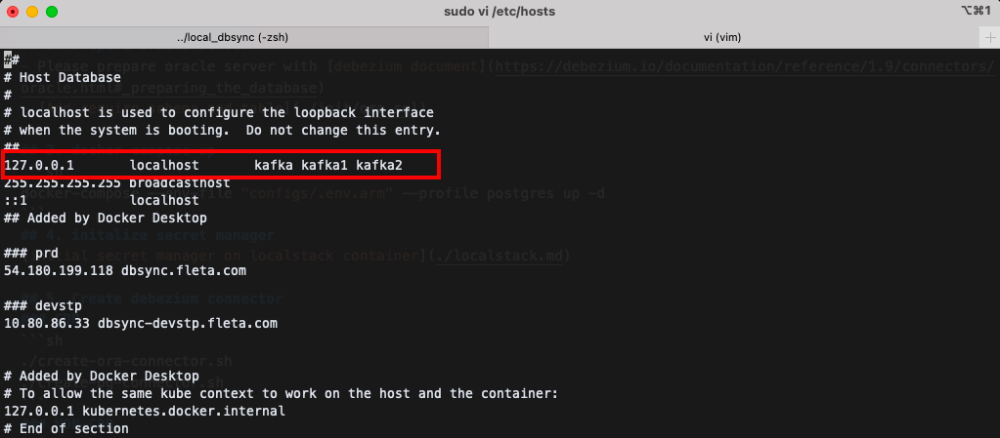
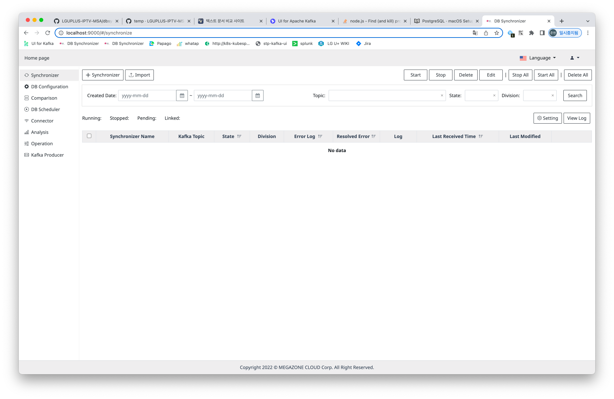
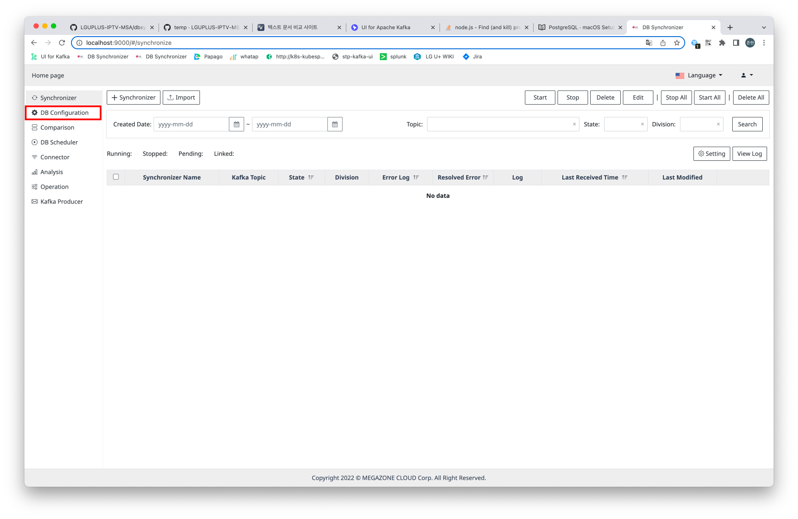
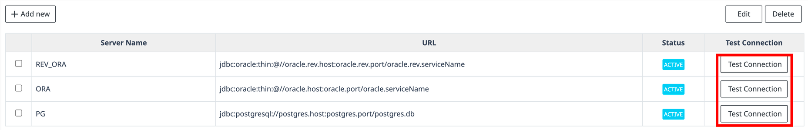
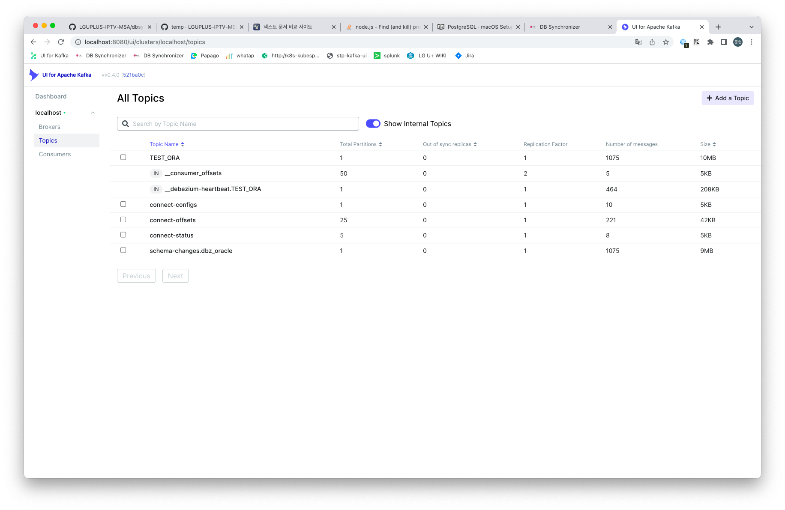

DBsync 서비스를 로컬환경에서 실행하는 절차입니다. 

# 작업 절차

## prepare source

1. 로컬에 저장할 디렉토리를 생성합니다



2. Git Clone 후 `develop` 브랜치 이동

```shell
git clone git@github.com:LGUPLUS-IPTV-MSA/dbsync-service.git

git checkout develop
```

3. 터미널을 켜서 `etc/hosts` 을 수정합니다.

아래 부분과 동일하게끔 수정

```shell
cd /
sudo vi etc/hosts
```



## Prepare Database & Kafka & Debezium Connector

[DataSync Docker 리소스 준비](/docker/local_server.md) 를 진행합니다.


## Run DbSync Application

```shell
./gradlew bootRun
```

- 성공적으로 실행되었다면, Chrome 에서 `http://localhost:9000` 실행시 DBsync 페이지로 이동합니다.
<br> 로컬환경의 아이디 / 패스워드는 `admin / admin123` 입니다.



- DB Configuration 로 이동합니다.



- Test Connection 버튼을 클릭하여 실제로 데이터 베이스와 연동이 되는지 확인합니다.



- localhost:8080에 접속하여 UI for Apache kafka 에 성공적으로 접속되는지 확인



- 성공적으로 창이 띄워졌다면 Local 환경에서 DBsync 어플리케이션을 테스트할 수 있다.